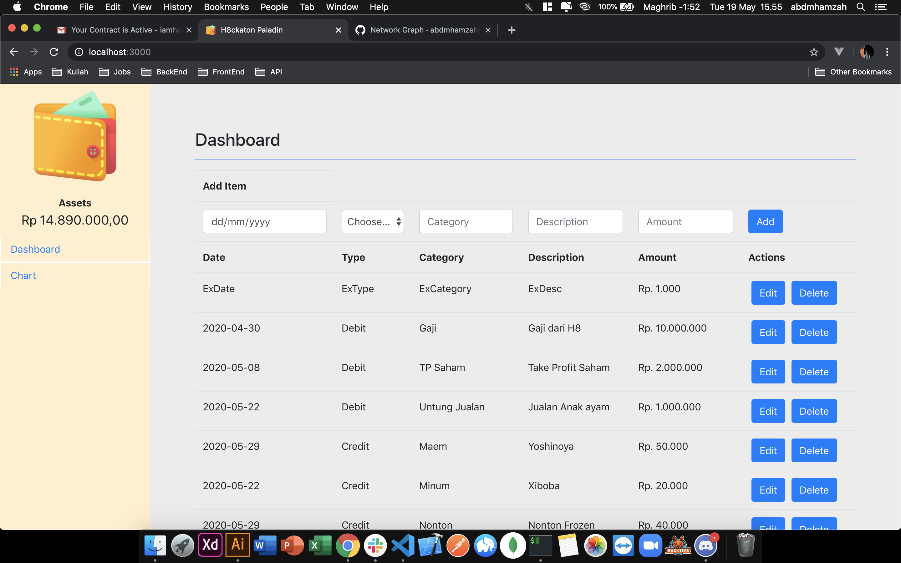

# h8ckaton-paladins

[![Contributors][contributors-shield]][contributors-url]
[![Forks][forks-shield]][forks-url]
[![Stargazers][stars-shield]][stars-url]
[![Issues][issues-shield]][issues-url]
[![LinkedIn][linkedin-shield]][linkedin-url]

<!-- [![MIT License][license-shield]][license-url] -->

<!-- PROJECT LOGO -->
<br />
<p align="center">
  <a href="https://github.com/abdmhamzah/h8ckaton-paladins">
    
  </a>

  <h3 align="center">H8ckaton Paladins</h3>

  <p align="center">
    An awesome README template to jumpstart your projects!
    <br />
    <a href="https://github.com/abdmhamzah/h8ckaton-paladins"><strong>Explore the docs »</strong></a>
    <br />
    <br />
    <a href="https://github.com/abdmhamzah/h8ckaton-paladins">View Demo</a>
    ·
    <a href="https://github.com/abdmhamzah/h8ckaton-paladins/issues">Report Bug</a>
    ·
    <a href="https://github.com/abdmhamzah/h8ckaton-paladins/issues">Request Feature</a>
  </p>
</p>

<!-- TABLE OF CONTENTS -->

## Table of Contents

- [About the Project](#about-the-project)
  - [Built With](#built-with)
- [Getting Started](#getting-started)
  - [Prerequisites](#prerequisites)
  - [Installation](#installation)
- [Roadmap](#roadmap)
- [Contributing](#contributing)
- [Contact](#contact)
- [Acknowledgements](#acknowledgements)
  <!-- - [Usage](#usage) -->
  <!-- - [License](#license) -->

<!-- ABOUT THE PROJECT -->

## About The Project




H8ckaton Paladin is our team name in Hacktiv8 Hackathon. In this project, we build simple Wallet application.
Nowadays we almost expenses our money without knowing where the money flow, with this application you can manage your expenses and also your incomes and watch where the money flow. This application Feature can serve you:

- Datasheet of your Incomes and Expenses
- Chart of your Expenses
- Chart of your Incomes
- Chart of your Incomes VS Expenses

### Built With

Frameworks we use to build this project.

- [React Js](https://reactjs.org/)
- [Redux](https://redux.js.org/)
- [Bootstrap](https://getbootstrap.com)
- [Chart Js](chartjs.org)

<!-- GETTING STARTED -->

## Getting Started

To get a local copy up and running follow these simple example steps.

### Prerequisites

This is list things you need to use the software and how to install them.

- npm

```sh
npm install npm@latest -g
```

### Installation

1. Clone the repo

```sh
git clone https://github.com/abdmhamzah/h8ckaton-paladins.git
```

2. Install NPM packages

```sh
npm install
```

3. Run Development in your Browser

```sh
npm run srart
```

<!-- USAGE EXAMPLES -->

<!-- ## Usage

Use this space to show useful examples of how a project can be used. Additional screenshots, code examples and demos work well in this space. You may also link to more resources.

_For more examples, please refer to the [Documentation](https://example.com)_ -->

<!-- ROADMAP -->

## Roadmap

See the [open issues](https://github.com/abdmhamzah/h8ckaton-paladins/issues) for a list of proposed features (and known issues).

<!-- CONTRIBUTING -->

## Contributing

Contributions are what make the open source community such an amazing place to be learn, inspire, and create. Any contributions you make are **greatly appreciated**.

1. Fork the Project
2. Create your Feature Branch (`git checkout -b feature/AmazingFeature`)
3. Commit your Changes (`git commit -m 'Add some AmazingFeature'`)
4. Push to the Branch (`git push origin feature/AmazingFeature`)
5. Open a Pull Request

<!-- LICENSE -->

<!-- ## License -->

<!-- Distributed under the MIT License. See `LICENSE` for more information. -->

<!-- CONTACT -->

## Contact

Our Team

- [Antonius Claudio](https://github.com/antonius-claudio)
- [Andy Evandy](https://github.com/andievandy)
- [Muhammad Hasbi Fauzi](https://github.com/hasbif)
- [Hamzah Abdullah Mubarak](https://github.com/abdmhamzah)

Project Link: [https://github.com/abdmhamzah/h8ckaton-paladins](https://github.com/abdmhamzah/h8ckaton-paladins)

<!-- ACKNOWLEDGEMENTS -->

## Acknowledgements

- [Sweetalert](https://sweetalert2.github.io/)
<!-- - [GitHub Emoji Cheat Sheet](https://www.webpagefx.com/tools/emoji-cheat-sheet)
- [Img Shields](https://shields.io)
- [Choose an Open Source License](https://choosealicense.com)
- [GitHub Pages](https://pages.github.com)
- [Animate.css](https://daneden.github.io/animate.css)
- [Loaders.css](https://connoratherton.com/loaders)
- [Slick Carousel](https://kenwheeler.github.io/slick)
- [Smooth Scroll](https://github.com/cferdinandi/smooth-scroll)
- [Sticky Kit](http://leafo.net/sticky-kit)
- [JVectorMap](http://jvectormap.com)
- [Font Awesome](https://fontawesome.com) -->

<!-- MARKDOWN LINKS & IMAGES -->
<!-- https://www.markdownguide.org/basic-syntax/#reference-style-links -->

[contributors-shield]: https://img.shields.io/github/contributors/abdmhamzah/h8ckaton-paladins.svg?style=flat-square
[contributors-url]: https://github.com/abdmhamzah/h8ckaton-paladins/graphs/contributors
[forks-shield]: https://img.shields.io/github/forks/abdmhamzah/h8ckaton-paladins.svg?style=flat-square
[forks-url]: https://github.com/abdmhamzah/h8ckaton-paladins/network/members
[stars-shield]: https://img.shields.io/github/stars/abdmhamzah/h8ckaton-paladins.svg?style=flat-square
[stars-url]: https://github.com/abdmhamzah/h8ckaton-paladins/stargazers
[issues-shield]: https://img.shields.io/github/issues/abdmhamzah/h8ckaton-paladins.svg?style=flat-square
[issues-url]: https://github.com/abdmhamzah/h8ckaton-paladins/issues
[license-shield]: https://img.shields.io/github/license/abdmhamzah/h8ckaton-paladins.svg?style=flat-square
[license-url]: https://github.com/abdmhamzah/h8ckaton-paladins/blob/master/LICENSE.txt
[linkedin-shield]: https://img.shields.io/badge/-LinkedIn-black.svg?style=flat-square&logo=linkedin&colorB=555
[linkedin-url]: https://linkedin.com/in/abdmhamzah
[product-screenshot]: images/screenshot.png
